# Fitness Adviser Service - Architecture Diagram

## High-Level Overview

```mermaid
graph LR
    subgraph "User"
        Athlete[Athlete<br/>👤]
    end

    subgraph "Fitness Adviser Service"
        App[Quarkus Application<br/>- OAuth/OIDC Security<br/>- WebSocket Chat<br/>- LangChain4j AI Service<br/>- Strava Integration]
    end

    subgraph "External Services"
        Strava[Strava<br/>🔐 OAuth Provider<br/>📊 Activity Data API<br/>🔔 Webhook Events]
        Gemini[Google Gemini AI<br/>🤖 LLM Chat Model]
    end

    Athlete -->|1. Authenticate| Strava
    Strava -->|2. OAuth Token| App
    Athlete -->|3. Chat via WebSocket| App
    App -->|4. AI Queries| Gemini
    App -->|5. Fetch Activity Data| Strava
    Strava -->|6. Activity Data| App
    App -->|7. AI Response| Athlete
    Strava -->|8. Real-time Events| App
    App -->|9. Forward Events| Athlete

    style Athlete fill:#e1f5ff
    style App fill:#fff4e1
    style Strava fill:#e1ffe1
    style Gemini fill:#ffe1f5
```



### Key Interactions

1. **Authentication Flow**: Athlete authenticates with Strava OAuth, service receives access token
2. **Chat Interface**: Real-time WebSocket connection for conversational fitness advice
3. **AI Processing**: LangChain4j service uses Gemini AI to understand queries and generate responses
4. **Data Integration**: Service fetches athlete's activity data from Strava API using OAuth token
5. **Intelligent Responses**: AI combines Strava data with conversation context to provide personalized fitness advice
6. **Real-time Updates**: Strava webhooks notify service of new activities, forwarded to connected clients

---

## Detailed Architecture Diagram

```mermaid
graph TB
    subgraph "Client Layer"
        Browser[Web Browser<br/>HTML/CSS/JS<br/>WebSocket Client]
    end

    subgraph "Quarkus Application"
        subgraph "REST Endpoints"
            LoginResource[LoginResource<br/>/login<br/>GET]
            LogoutResource[LogoutResource<br/>/logout<br/>GET]
            SubscriptionResource[StravaSubscription<br/>/subscription<br/>GET/POST]
            ImportmapResource[ImportmapResource<br/>/_importmap<br/>Dynamic Import Maps]
        end

        subgraph "WebSocket"
            FitnessAdviserWS[FitnessAdviserResource<br/>/fitnessAdviser<br/>WebSocket Endpoint]
        end

        subgraph "Security Layer"
            OIDC[Quarkus OIDC<br/>Strava Provider<br/>Token Management]
        end

        subgraph "AI Service Layer"
            FitnessAdviserService[FitnessAdviserService<br/>LangChain4j AI Service<br/>Session Scoped]
            ChatMemory[Chat Memory<br/>Window: 10 messages]
            ChatModelListener[AssistantChatModelListener<br/>Streaming Response Handler]
        end

        subgraph "Tools Layer"
            FitnessAdviserTools[FitnessAdviserTools<br/>- getAthleteName<br/>- getAthleteProfile]
            StravaAthleteClient[StravaAthleteClient<br/>REST Client<br/>@Tool Annotated]
        end

        subgraph "Subscription Management"
            SubscriptionManager[StravaSubscriptionManager<br/>Push Subscription Handler]
            StravaSubscriptionClient[StravaSubscriptionClient<br/>REST Client]
        end
    end

    subgraph "External Services"
        StravaOAuth[Strava OAuth/OIDC<br/>Authentication Provider]
        StravaAPI[Strava API v3<br/>- /athletes/{id}/stats<br/>- /athlete/activities<br/>- /activities/{id}<br/>- /activities/{id}/laps<br/>- /activities/{id}/zones<br/>- /activities/{id}/streams<br/>- /activities/{id}/kudos<br/>- /athlete/routes]
        GeminiAI[Google Gemini AI<br/>Chat Model<br/>LangChain4j Integration]
    end

    %% User Flow
    Browser -->|1. OAuth Redirect| StravaOAuth
    StravaOAuth -->|2. OAuth Callback| OIDC
    OIDC -->|3. Authenticated Request| LoginResource
    LoginResource -->|4. Render Template| Browser
    LoginResource -->|5. Create Subscription| SubscriptionManager
    SubscriptionManager -->|6. POST /push_subscriptions| StravaSubscriptionClient
    StravaSubscriptionClient -->|7. API Call| StravaAPI

    %% WebSocket Chat Flow
    Browser -->|8. WebSocket Connect| FitnessAdviserWS
    FitnessAdviserWS -->|9. User Message| FitnessAdviserService
    FitnessAdviserService -->|10. Query| GeminiAI
    GeminiAI -->|11. Tool Execution Request| FitnessAdviserService
    FitnessAdviserService -->|12. Execute Tools| FitnessAdviserTools
    FitnessAdviserService -->|13. Execute Tools| StravaAthleteClient
    StravaAthleteClient -->|14. API Call with OAuth Token| StravaAPI
    StravaAPI -->|15. Activity Data| StravaAthleteClient
    StravaAthleteClient -->|16. Tool Result| FitnessAdviserService
    FitnessAdviserTools -->|17. User Info| FitnessAdviserService
    FitnessAdviserService -->|18. AI Response| ChatModelListener
    ChatModelListener -->|19. Stream Response| FitnessAdviserWS
    FitnessAdviserWS -->|20. WebSocket Message| Browser
    FitnessAdviserService -->|21. Store Context| ChatMemory

    %% Webhook Flow
    StravaAPI -->|22. Webhook Event| SubscriptionResource
    SubscriptionResource -->|23. Forward Event| FitnessAdviserWS

    %% Security
    OIDC -.->|Token Propagation| StravaAthleteClient
    OIDC -.->|User Info| FitnessAdviserTools
    OIDC -.->|Access Token| SubscriptionManager

    %% Logout Flow
    Browser -->|24. Logout Request| LogoutResource
    LogoutResource -->|25. Delete Subscription| SubscriptionManager
    SubscriptionManager -->|26. DELETE /push_subscriptions/{id}| StravaSubscriptionClient
    StravaSubscriptionClient -->|27. API Call| StravaAPI
    LogoutResource -->|28. Clear Session| OIDC
    LogoutResource -->|29. Redirect| Browser

    style Browser fill:#e1f5ff
    style FitnessAdviserService fill:#fff4e1
    style GeminiAI fill:#ffe1f5
    style StravaAPI fill:#e1ffe1
    style StravaOAuth fill:#e1ffe1
    style OIDC fill:#ffe1e1
```

## Component Descriptions

### Client Layer
- **Web Browser**: HTML/CSS/JavaScript frontend with WebSocket client for real-time chat

### REST Endpoints
- **LoginResource**: Handles OAuth callback, renders fitness adviser HTML template
- **LogoutResource**: Cleans up subscriptions and clears OIDC session
- **StravaSubscription**: Webhook endpoint for Strava push notifications (GET for verification, POST for events)
- **ImportmapResource**: Dynamically generates import maps for ES modules

### WebSocket
- **FitnessAdviserResource**: WebSocket endpoint for real-time chat with the fitness adviser AI

### Security Layer
- **Quarkus OIDC**: Manages Strava OAuth/OIDC authentication, token storage, and propagation

### AI Service Layer
- **FitnessAdviserService**: LangChain4j AI service interface that orchestrates chat interactions
- **ChatMemory**: Maintains conversation context (10 message window)
- **AssistantChatModelListener**: Handles streaming responses from Gemini AI

### Tools Layer
- **FitnessAdviserTools**: Custom tools for accessing user profile information from OIDC UserInfo
- **StravaAthleteClient**: REST client with @Tool annotations that expose Strava API endpoints as AI tools

### Subscription Management
- **StravaSubscriptionManager**: Manages Strava webhook subscriptions
- **StravaSubscriptionClient**: REST client for Strava subscription API

### External Services
- **Strava OAuth/OIDC**: Authentication provider
- **Strava API v3**: REST API for athlete data, activities, stats, routes, etc.
- **Google Gemini AI**: Large language model for generating fitness advice

## Data Flow

1. **Authentication**: User authenticates via Strava OAuth, tokens are managed by Quarkus OIDC
2. **Chat Interaction**: User sends messages via WebSocket → AI Service → Gemini AI
3. **Tool Execution**: AI requests data → Tools execute → Strava API called with OAuth token → Data returned to AI
4. **Response Streaming**: AI generates response → ChatModelListener streams to WebSocket → Browser displays
5. **Webhooks**: Strava sends events → Subscription endpoint → Forwarded to WebSocket clients
